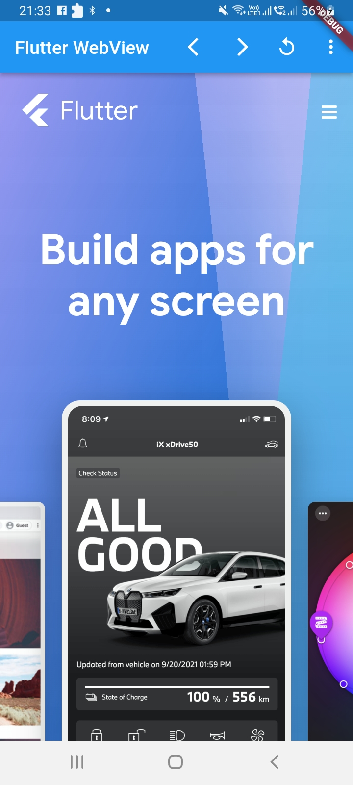
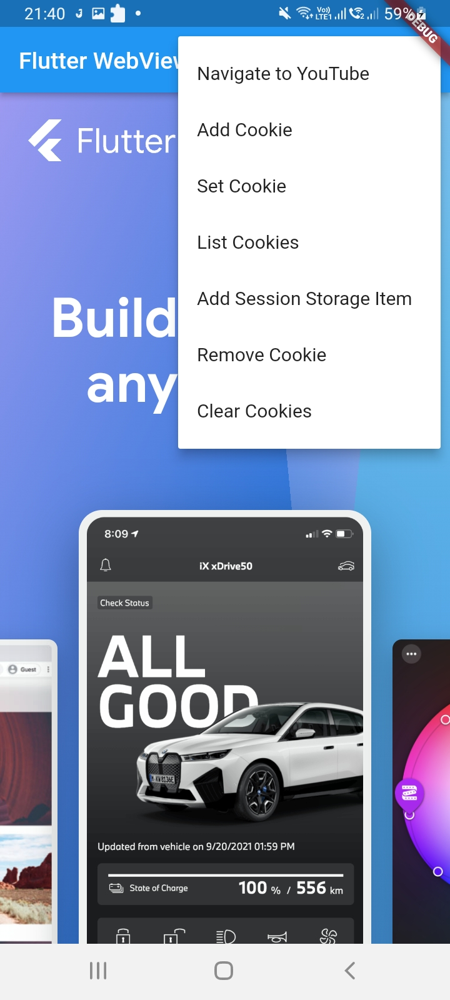

# Flutter WebView
This repo demonstrate the use of Flutter WebView.

# About
- This repo covers the following scenarios
1. Loading web page.
2. Tracking progress through callbacks.
3. Handle navigation between web pages.
4. Add Cookies
5. Add data to session storage

# Screenshots
<table style="width:100%">
  <tr>
    <th>OnBoarding</th>
    <th>Options</th>
  </tr>
  <tr>
    <td></td>
    <td></td>
  </tr>
</table>